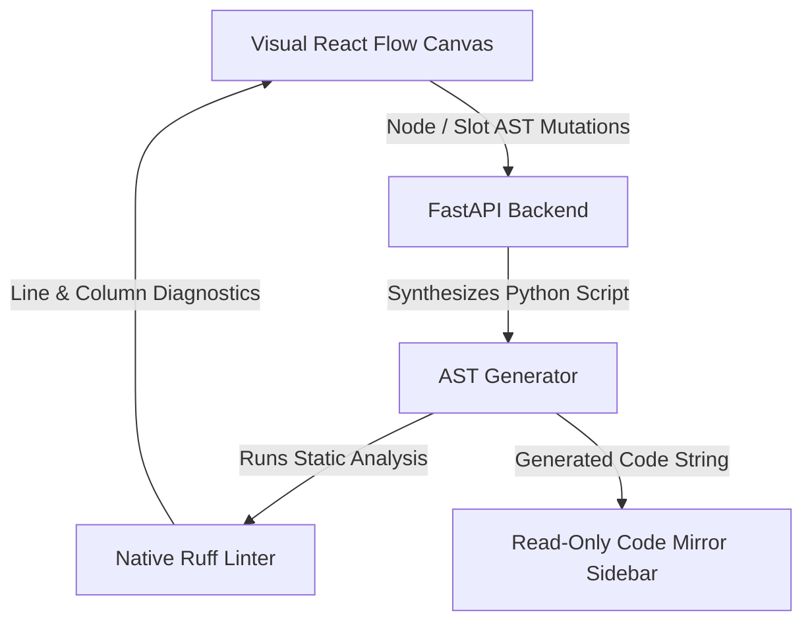

# Graphboard

**Graphboard** is a visual, logic-driven graph editor for building, compiling, and running **LangGraph** workflows in Python.

Instead of writing complex state machine code manually, Graphboard provides a visual canvas where you design logic using connected nodes and simple conditional rules. Graphboard automatically generates clean, executable Python scripts in real time and validates them instantly on the backend.

### 🚀 Project Status & R&D Evolution
This repository serves as a personal, non-commercial full-stack R&D exploration and engineering showcase for full-stack AI system design. It builds directly upon ideas from a previous project (**Mapboard**), introducing two core architectural evolutions:
* **Backend Stack:** Migrated from Nest.js/Node.js to a Python/FastAPI ecosystem.
* **Execution Strategy:** Replaced a custom DAG execution engine with an ongoing, active implementation of a LangGraph-based state machine interpreter.

*This project serves as a showcase of advanced conversational state control, real-time visual-to-code translation layer design, and complex React/FastAPI architecture.*

---

---

## 💡 How It Works

1. **Build Visually**: Arrange execution nodes (Steps, Switches/Decisions, Entry & Exit sentinels) on an auto-layout canvas.
2. **Define Logic via Expressions**: Assign AST expression conditions to decision slots and state updates to step nodes.
3. **Inspect Generated Python Code**: Graphboard deterministically compiles your visual graph into clean Python code using standard `LangGraph` primitive calls (`StateGraph`, `add_node`, `add_conditional_edges`) and `TypedDict` state definitions.
4. **Instant Diagnostic Feedback**: The Python backend executes native `Ruff` static analysis on the generated code, surfacing errors and warnings directly onto visual canvas elements and the CodeMirror sidebar viewer.

---

## 🧩 Visual Node Roles & Code Mapping

| Node Type | Role | Generated Python Representation |
| :--- | :--- | :--- |
| **START** | Entry point of execution flow | Mapped to `START` sentinel: `workflow.add_edge(START, "first_step")` |
| **END** | Exit point / state machine termination | Mapped to `END` sentinel: `workflow.add_edge("last_step", END)` |
| **DEFINER** | Declares state schema variables (`key`, `type`, `default_value`) | Mapped to `class State(TypedDict):` definition. Emits **0 Python functions** and is bypassed in compiled static graph edges (`workflow.add_edge(START, "first_step")`). Sentinel protected (`START -> DEFINER -> ... -> END`). |
| **STEP** | Performs state updates or task execution | Generated Python function registered via `workflow.add_node("step_name", func)` |
| **LOGICAL_ASSIGNER** | Performs deterministic inline variable assignments | Generated Python function mutating `state` dict values |
| **AGENTIC_ASSIGNER** | Invokes LLM agents for state mutations | Generated Python function calling agentic runner |
| **SWITCH** | Evaluates conditional branching logic | Router function evaluating AST expressions in `if/elif` order, registered via `workflow.add_conditional_edges(...)` |

---

## 📈 Project Progress Tracker (Incremental Phase Backstory)

### Phase 1: Auto-Layout Graph Canvas
* **Programmatic Positioning**: Configured React Flow with disabled manual node dragging, delegating all coordinate calculations to the ELK (Eclipse Layout Kernel) engine.
* **Detour Routing**: Programmatically detected back-edges (feedback loops) and routed connections around node borders to avoid layout distortion.
* **Dynamic Slot Rendering**: Implemented reactive output handles on Switch nodes that sync dynamically via `updateNodeInternals` when slot structures change.

### Phase 2: Specialized Node Operations & State Schemas
* **State DEFINER Sentinels**: Protected workflow entry states via a non-deletable `DEFINER` sentinel node featuring a dedicated Radix UI state schema editor.
* **Extensible Operations Containers**: Structured specialized execution nodes (`LOGICAL_ASSIGNER`, `AGENTIC_ASSIGNER`) using decoupled domain models (`definer`, `logical`, `agentic`, `switch`) linked by reference IDs.

### Phase 3: Server Persistence & WebSocket Sync
* **TanStack Query Sync**: Synchronized visual node mutations and layout states with the FastAPI database asynchronously.
* **Unit of Work Event Buffering**: Implemented a FastAPI Unit of Work transaction manager that buffers WebSocket updates to prevent broadcasting data before database commits complete.
* **Canvas Snapshot History**: Added sequential snapshot models to database history rows enabling persistent, server-backed undo/redo actions.

### Phase 4: LangGraph Code Compiler & Runtime
* **Deterministic Code Synthesis**: Created a python AST compilation engine that parses visual nodes and slots into native LangGraph code (`StateGraph`, `START`, `END`, conditional routing).
* **Safe Sandbox Runtime**: Configured a subprocess pool executor to safely execute compiled python workflows on the FastAPI backend, returning terminal execution results.

### Phase 5: Interactive Code Inspector & Diagnostics
* **Bidirectional AST Selection**: Traversed CodeMirror 6 and visual canvas nodes to highlight code functions when clicking nodes, and select visual elements when clicking code regions.
* **Real-time Ruff Diagnostics**: Ran native Ruff static analysis on generated python code via sub-millisecond backend subprocesses, returning line/column diagnostics to highlight canvas errors.
* **Read-Only Editor lock**: Secured generated code viewer in CodeMirror to be read-only while keeping AST-based folding and navigation fully interactive.

---

## 🏗️ Architecture Overview

### Key Technical Choices
* **Pure Server State Architecture**: TanStack Query manages API mutations, caching, and server state, while React Flow manages canvas selection state natively.
* **Auto-Layout ONLY (No Drag-and-Drop)**: Coordinates `(x, y)` are computed on the fly by ELK in two phases: unmeasured initial load and deferred measuring on node dimension resizes.
* **String-Based Identifiers**: Node and slot IDs use human-readable strings (e.g. `"step_1"`, `"option_a"`), matching the execution keys in compiled LangGraph workflows.

---

## 🛠️ Tech Stack

* **Frontend**: React 19, TypeScript, React Flow (@xyflow/react), ELKjs, CodeMirror 6, TanStack Query v5, Radix UI.
* **Backend**: Python 3.12+, FastAPI, LangGraph, SQLAlchemy 2.0, Pydantic v2, Ruff.

---

## 📌 Implementation Gotchas & Quirks

* **Handle Lifecycle (`updateNodeInternals`)**: When slots are added or removed dynamically on SWITCH nodes, React Flow's cached handle locations become stale. We listen to `node.slots` changes in `FlowNode.tsx` to trigger `updateNodeInternals(id)` whenever slot structure updates.
* **CodeMirror Read-Only Guard**: Setting `EditorState.readOnly.of(true)` across CodeMirror locks typing while allowing `@codemirror/language` AST syntax tree iteration to continue driving bidirectional node highlighting and code folding.
* **Native Ruff CLI Subprocess**: Running `ruff check` natively on the backend executes in sub-milliseconds, completely eliminating WASM bundle overhead on the frontend.
* **Sentinel Topology Enforcement (`START -> DEFINER -> END`)**: `DEFINER` nodes are protected sentinels that cannot be deleted or shortcircuited. During AST code generation, `resolve_target` traces through `DEFINER` nodes with cycle protection to emit direct LangGraph edges from `START` to downstream execution nodes.

