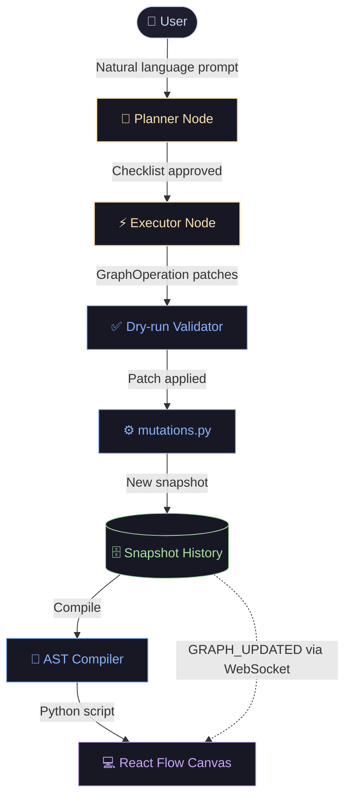

# Graphboard

A personal R&D project: a visual canvas and AI Copilot for designing, compiling, and running **LangGraph** workflows in Python.

### 🚀 Project Evolution
Second iteration of this idea, building directly on **Mapboard** (a previous client-side visual graph builder in Nest.js/Node.js). Graphboard shifts to a backend-first architecture — the graph is owned and mutated exclusively by the server, with the AI Copilot as the primary interface for modifications: multi-stage planning, dry-run validation, and human-in-the-loop checkpoints before committing any changes. The visual canvas is now a read-only inspector; manual node editing has been removed in favour of the agentic model.

---

---

## 🌟 Core Engineering Highlights
* **Agentic LangGraph Copilot:** Orchestrates modifications using a dual-stage (Planner $\rightarrow$ Executor) LangGraph agent with human-in-the-loop validation checkpoints.
* **Real-time AST Compiler:** Dynamically compiles the visual graph schema directly into native Python LangGraph code.
* **Transactional Patch Protocol:** Modifies graph topology programmatically via structured `GraphOperation` patches, ensuring referential integrity and cascading updates.
* **Isolated Subprocess Sandbox:** Runs compiled user workflows inside a dedicated spawned subprocess with a hard 5-second timeout, terminating it explicitly to protect the main FastAPI server from infinite loops.

## 💡 How It Works

1. **Natural Language Requests**: The user prompts the Copilot to modify the graph logic (e.g., *"Add a fifty-fifty lifeline"*).
2. **Agentic Patch Generation**: The AI Copilot uses a multi-stage LangGraph workflow to generate a plan, which is executed as a series of structured `GraphOperation` patches (`upsert_node`, `delete_node`, `connect`, etc.).
3. **Strict Schema Integrity Guard**: Before patches are committed, the backend runs dry-run validations, managing cascading variable renames or blocking invalid operations.
4. **LangGraph Code Compiler**: The backend compiles the new graph structure into executable Python code using standard `LangGraph` primitives (`StateGraph`, `add_conditional_edges`, `interrupt`).
5. **WebSocket-Triggered UI Sync**: On patch commit, the backend emits a `GRAPH_UPDATED` event over a WebSocket broker, which triggers the frontend canvas to re-fetch and render the updated graph topology and Python code.

---

## 🧩 Visual Node Roles & Code Mapping

| Node Type | Category | Role | Generated Python Representation |
| :--- | :--- | :--- | :--- |
| **START** | Sentinel | Entry point of execution flow | Mapped to `START` sentinel: `workflow.add_edge(START, "first_step")` |
| **END** | Sentinel | Exit point / state machine termination | Mapped to `END` sentinel: `workflow.add_edge("last_step", END)` |
| **LOGICAL_ASSIGNER** | Computation | Performs deterministic inline variable assignments | Generated Python function returning updated state dictionary |
| **AGENTIC_ASSIGNER** | Computation | Invokes LLM agents for structured state mutations | Generated Python function calling Groq LLM with Pydantic response format |
| **LOGICAL_SWITCH** | Routing | Evaluates deterministic expression branching logic | Router function evaluating AST expressions, registered via `workflow.add_conditional_edges(...)` |
| **AGENTIC_SWITCH** | Routing | LLM-driven decision routing across slot options | Router function parsing LLM choice output to select outgoing branch |
| **INTERRUPT** | Human & Control | Pauses workflow execution for user payload | Generated Python function calling `langgraph.types.interrupt(...)` |

### Node Vocabulary Design Rationale
The five primitive types form a deliberate **2×2 grid plus one control primitive**:

| | Deterministic | AI-Driven |
| :--- | :--- | :--- |
| **Computation** | `LOGICAL_ASSIGNER` | `AGENTIC_ASSIGNER` |
| **Routing** | `LOGICAL_SWITCH` | `AGENTIC_SWITCH` |
| **Control** | `INTERRUPT` | — |

This covers every fundamental pattern in an agentic state machine: transforming state (deterministically or via LLM), making routing decisions (by expression or by LLM classification), and yielding control back to a human. The vocabulary is intentionally small — small enough that the AI Copilot can reliably generate valid operations, and small enough that each primitive maps cleanly to a known LangGraph construct. Future extensions (e.g. `TOOL_CALL`, `PARALLEL_FAN_OUT`, `MEMORY_RETRIEVAL`) would fit the same deterministic/agentic axis.

---

## 📈 R&D Progress Tracker

### Phase 1: Auto-Layout Canvas & Persistence
* **ELK-Driven Positioning**: Configured React Flow with programmatically managed node coordinates driven by the ELK (Eclipse Layout Kernel) layout engine.
* **Unified Persistence**: Integrated a FastAPI Unit of Work transaction manager that saves graph snapshots sequentially as a version history, enabling version browsing on the frontend.

### Phase 2: Direct Compiler & Sandbox
* **Discriminated Union Schema**: Structured `NodeRead` into per-type models discriminated by `node_type`, containing only relevant primitive properties.
* **Direct AST Synthesis**: Created a python AST compiler mapping visual nodes directly into Python statements.
* **Subprocess Isolation**: Compiled scripts run in a dedicated spawned subprocess with a hard timeout, preventing infinite loops from hanging the main API thread.

### Phase 3: Coarse-Grained Patch Mutations & Type Safety
* **Consolidated mutations**: Unified topology and operations alterations under a single `mutations.py` module.
* **Discriminator Config Union**: Refactored `UpsertNodeOp` configuration payloads to be dynamically parsed and validated into strongly-typed config models (`LogicalAssignerConfig`, etc.) via Pydantic model validators.
* **AST Expressions Consolidation**: Centralized expression-to-code, variable tracking, and cascading renames into the expression module, deleting duplicate recursive traversals across the codebase.

### Phase 4: Agentic Copilot & Flow Engineering (Active R&D)
* **Dual-Stage LangGraph Copilot**: Implemented a multi-stage planner/executor workflow using Groq LLM tool-calling. A `planner_node` establishes a high-level checklist; an `executor_node` translates it into structured `GraphOperation` patches.
* **Human-in-the-Loop Interruption**: Configured LangGraph state interrupts (`wait_for_plan_node`, `wait_for_apply_node`) to pause execution at each stage for user review before committing changes.
* **Dry-Run Validation**: Agent-generated patches are validated against the backend's mutations engine and AST compiler before being committed. The Copilot is constrained to emit structured operations rather than raw code specifically so this validation step is deterministic and reliable.
* **Design Note**: This constraint (structured ops vs. free-form code) is a deliberate architectural choice — it makes agent output atomically versionable, dry-run-testable, and compiler-safe, at the cost of a fixed primitive vocabulary.
* **🔮 Next Steps / Active R&D**:
  * **Self-Correction Retry Loops**: Route compiler and dry-run traceback exceptions back into the LangGraph state machine so the LLM agent can auto-correct its operations on validation failure.
  * **Automated Agent Evals**: Set up regression-testing suites and an LLM-as-a-judge eval harness to measure agent accuracy across common graph editing scenarios.

---

## 🏗️ Architecture Overview

### Key Technical Constraints
* **Transaction-Level Integrity**: Variable referential constraints are validated on every patch. Topological completeness (e.g., unconnected slots) is deferred to execution-time to allow users and AI agents to build graphs incrementally.
* **UoW Transaction Timing**: Endpoints mutating data must manage transaction boundaries using `async with uow:` blocks to ensure SQL writes and event brokers finish before returning HTTP responses.

---

## 🛠️ Tech Stack

* **Frontend**: React 19, TypeScript, React Flow (@xyflow/react), ELKjs, CodeMirror 6, TanStack Query v5, Radix UI.
* **Backend**: Python 3.12+, FastAPI, LangGraph, SQLAlchemy 2.0, Pydantic v2.
