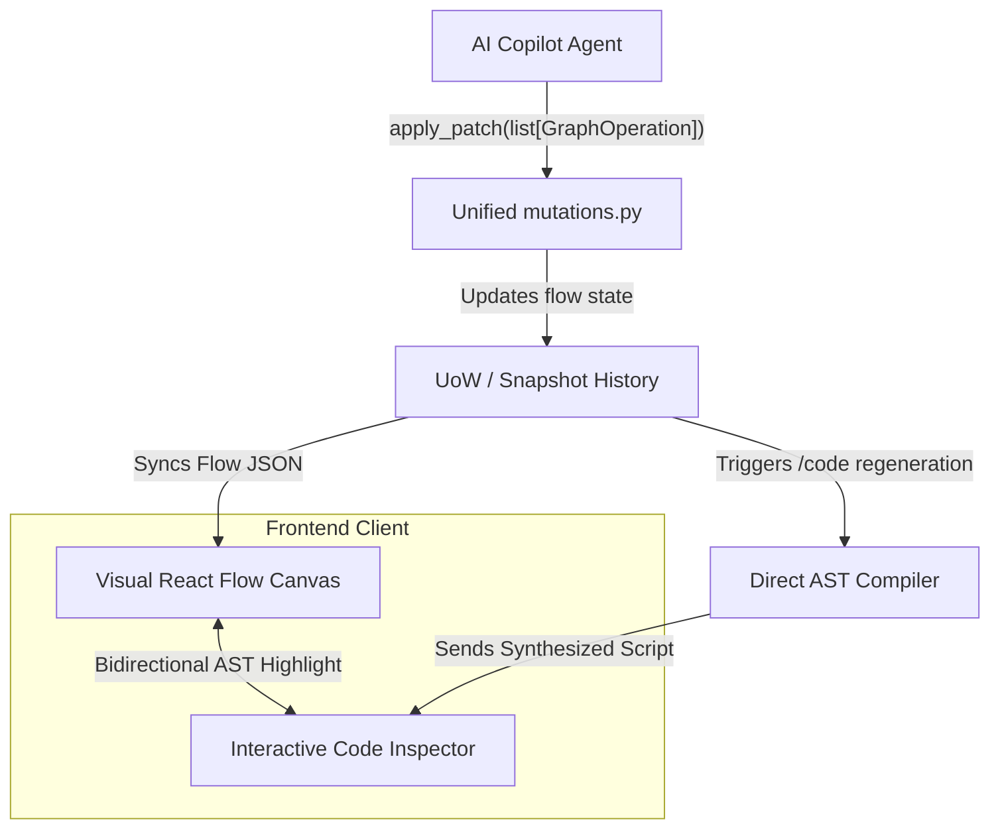

# Graphboard

**Graphboard** is a visual, logic-driven graph editor for building, compiling, and running **LangGraph** workflows in Python.

Instead of writing complex state machine code manually, Graphboard provides a visual canvas where you design logic using connected nodes and simple conditional rules. Graphboard automatically generates clean, executable Python scripts in real time and validates them instantly on the backend.

### 🚀 Project Status & R&D Evolution
This repository serves as a personal, non-commercial R&D exploration and engineering showcase for full-stack AI system design. It builds directly upon ideas from a previous project (**Mapboard**), introducing two core architectural evolutions:
* **Backend Stack:** Migrated from Nest.js/Node.js to a Python/FastAPI/SQLAlchemy ecosystem.
* **Evolution of R&D Focus**: The project has migrated away from client-side graph builder capabilities to a **Backend-Only AI-driven mutation model**. The graph structure is edited programmatically via structured `GraphOperation` patches processed on the backend, preparing the pipeline for native AI Copilot-driven workflow orchestration.

---

---

## 💡 How It Works

1. **Structured Mutations**: Visual graph modifications are processed via sequential `GraphOperation` patches (`upsert_node`, `delete_node`, `connect`, `disconnect`, `upsert_state_var`, `delete_state_var`) executed transactional-style on the backend.
2. **Strict Schema Integrity Guard**: State variable renames cascade automatically to all referencing nodes and expressions, and variable deletions are strictly blocked if they are referenced.
3. **LangGraph Code Compiler**: Graphboard compiles the visual graph into clean Python code using standard `LangGraph` primitive calls (`StateGraph`, `add_node`, `add_conditional_edges`) and `TypedDict` state definitions.
4. **Subprocess Sandbox Execution**: Workflows run in an isolated subprocess (`ProcessPoolExecutor`) with execution timeouts to safely capture variables and diagnostics without crashing the server.

---

## 🧩 Visual Node Roles & Code Mapping

| Node Type | Category | Role | Generated Python Representation |
| :--- | :--- | :--- | :--- |
| **START** | Sentinel | Entry point of execution flow | Mapped to `START` sentinel: `workflow.add_edge(START, "first_step")` |
| **END** | Sentinel | Exit point / state machine termination | Mapped to `END` sentinel: `workflow.add_edge("last_step", END)` |
| **LOGICAL_ASSIGNER** | Computation | Performs deterministic inline variable assignments | Generated Python function returning updated state dictionary |
| **AGENTIC_ASSIGNER** | Computation | Invokes LLM agents for structured state mutations | Generated Python function calling Groq LLM with Pydantic response format |
| **LOGICAL_SWITCH** | Routing | Evaluates deterministic expression branching logic | Router function evaluating AST expressions, registered via `workflow.add_conditional_edges(...)` |
| **AGENTIC_SWITCH** | Routing | LLM-driven decision routing across slot options | Router function parsing LLM choice output to select outgoing branch |
| **INTERRUPT** | Human & Control | Pauses workflow execution for user payload | Generated Python function calling `langgraph.types.interrupt(...)` |

---

## 📈 R&D Progress Tracker

### Phase 1: Auto-Layout Canvas & Persistence
* **ELK-Driven Positioning**: Configured React Flow with programmatically managed node coordinates driven by the ELK (Eclipse Layout Kernel) layout engine.
* **Unified Persistence**: Integrated a FastAPI Unit of Work transaction manager that saves graph snapshots sequentially to support persistent database-backed undo/redo history.

### Phase 2: Direct 1-Layer Compiler & Sandbox
* **Discriminated Union Schema**: Structured `NodeRead` into per-type models discriminated by `node_type`, containing only relevant primitive properties.
* **Direct AST Synthesis**: Created a python AST compiler mapping visual nodes directly into Python statements.
* **Subprocess Isolation**: Configured process-pool execution for compiled scripts to prevent infinite loops from hanging the main API thread.

### Phase 3: Coarse-Grained Patch Mutations & Type Safety
* **Consolidated mutations**: Unified topology and operations alterations under a single `mutations.py` module.
* **Discriminator Config Union**: Refactored `UpsertNodeOp` configuration payloads to be dynamically parsed and validated into strongly-typed config models (`LogicalAssignerConfig`, etc.) via Pydantic model validators.
* **AST Expressions Consolidation**: Centralized expression-to-code, variable tracking, and cascading renames into the expression module, deleting duplicate recursive traversals across the codebase.

---

## 🏗️ Architecture Overview

### Key Technical Constraints
* **Transaction-Level Integrity**: Variable referential constraints are validated on every patch. Topological completeness (e.g., unconnected slots) is deferred to execution-time to allow users and AI agents to build graphs incrementally.
* **UoW Transaction Timing**: Endpoints mutating data must manage transaction boundaries using `async with uow:` blocks to ensure SQL writes and event brokers finish before returning HTTP responses.

---

## 🛠️ Tech Stack

* **Frontend**: React 19, TypeScript, React Flow (@xyflow/react), ELKjs, CodeMirror 6, TanStack Query v5, Radix UI.
* **Backend**: Python 3.12+, FastAPI, LangGraph, SQLAlchemy 2.0, Pydantic v2.
