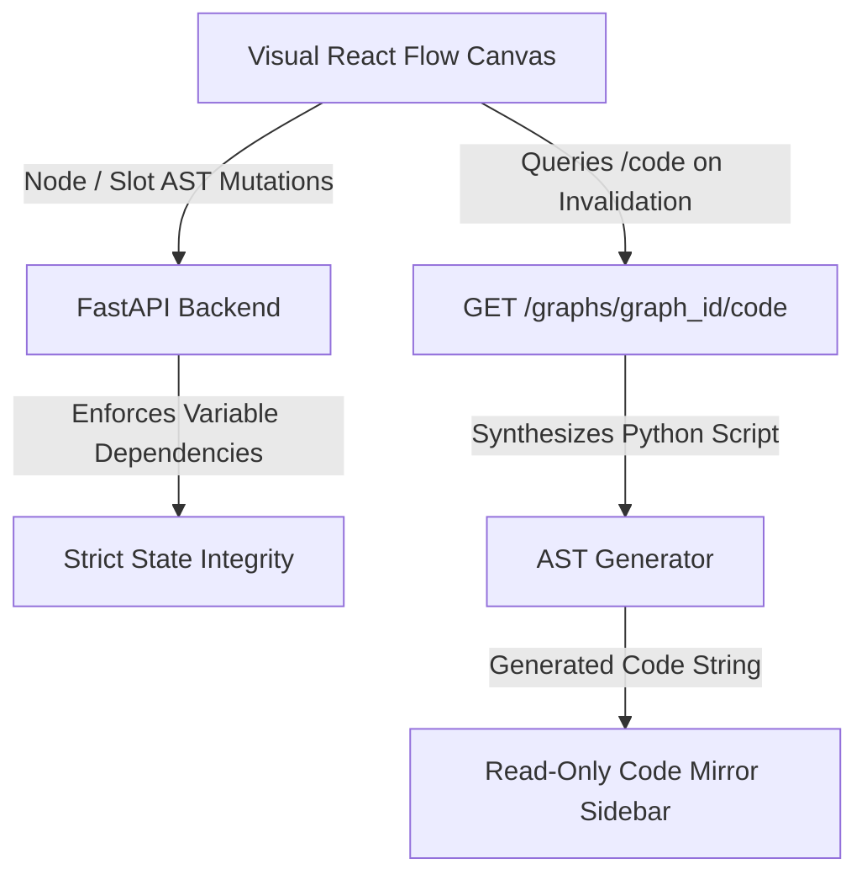

# Graphboard

**Graphboard** is a visual, logic-driven graph editor for building, compiling, and running **LangGraph** workflows in Python.

Instead of writing complex state machine code manually, Graphboard provides a visual canvas where you design logic using connected nodes and simple conditional rules. Graphboard automatically generates clean, executable Python scripts in real time and validates them instantly on the backend.

### 🚀 Project Status & R&D Evolution
This repository serves as a personal, non-commercial full-stack R&D exploration and engineering showcase for full-stack AI system design. It builds directly upon ideas from a previous project (**Mapboard**), introducing two core architectural evolutions:
* **Backend Stack:** Migrated from Nest.js/Node.js to a Python/FastAPI ecosystem.
* **Execution Strategy:** Replaced a custom DAG execution engine with an ongoing, active implementation of a LangGraph-based state machine interpreter.

*This project serves as a showcase of advanced conversational state control, real-time visual-to-code translation layer design, and complex React/FastAPI architecture.*

---

---

## 💡 How It Works

1. **Build Visually**: Arrange execution nodes (Logical Assigner, Agentic Assigner, Switches/Decisions, Entry & Exit sentinels) on an auto-layout canvas.
2. **Define Logic via Expressions**: Assign AST expression conditions to decision slots and state updates to assigner nodes.
3. **Inspect Generated Python Code**: Graphboard deterministically compiles your visual graph into clean Python code using standard `LangGraph` primitive calls (`StateGraph`, `add_node`, `add_conditional_edges`) and `TypedDict` state definitions.
4. **Strict Schema Integrity & Topological Guard**: State variable renames cascade automatically to all referencing nodes/expressions, and variable deletions are strictly blocked if they are referenced. A pre-execution guard validates topological completeness (unset expressions or unconnected nodes) before running the graph.

---

## 🧩 Visual Node Roles & Code Mapping

| Node Type | Role | Generated Python Representation |
| :--- | :--- | :--- |
| **START** | Entry point of execution flow | Mapped to `START` sentinel: `workflow.add_edge(START, "first_step")` |
| **END** | Exit point / state machine termination | Mapped to `END` sentinel: `workflow.add_edge("last_step", END)` |
| **LOGICAL_ASSIGNER** | Performs deterministic inline variable assignments | Generated Python function mutating `state` dict values |
| **AGENTIC_ASSIGNER** | Invokes LLM agents for state mutations | Generated Python function calling agentic runner |
| **SWITCH** | Evaluates conditional branching logic | Router function evaluating AST expressions in `if/elif` order, registered via `workflow.add_conditional_edges(...)` |

---

## 📈 Project Progress Tracker (Incremental Phase Backstory)

### Phase 1: Auto-Layout Graph Canvas
* **Programmatic Positioning**: Configured React Flow with disabled manual node dragging, delegating all coordinate calculations to the ELK (Eclipse Layout Kernel) engine.
* **Detour Routing**: Programmatically detected back-edges (feedback loops) and routed connections around node borders to avoid layout distortion.
* **Dynamic Slot Rendering**: Implemented reactive output handles on Switch nodes that sync dynamically via `updateNodeInternals` when slot structures change.

### Phase 2: Specialized Node Operations & State Schemas
* **State Schema Definitions**: Managed workflow state definitions via a dedicated Radix UI state schema editor.
* **Extensible Operations Containers**: Structured specialized execution nodes (`LOGICAL_ASSIGNER`, `AGENTIC_ASSIGNER`) using decoupled domain models (`definer`, `logical`, `agentic`, `switch`) linked by reference IDs.

### Phase 3: Server Persistence & WebSocket Sync
* **TanStack Query Sync**: Synchronized visual node mutations and layout states with the FastAPI database asynchronously.
* **Unit of Work Event Buffering**: Implemented a FastAPI Unit of Work transaction manager that buffers WebSocket updates to prevent broadcasting data before database commits complete.
* **Canvas Snapshot History**: Added sequential snapshot models to database history rows enabling persistent, server-backed undo/redo actions.

### Phase 4: LangGraph Code Compiler & Runtime
* **Deterministic Code Synthesis**: Created a python AST compilation engine that parses visual nodes and slots into native LangGraph code (`StateGraph`, `START`, `END`, conditional routing).
* **Safe Sandbox Runtime**: Configured a subprocess pool executor to safely execute compiled python workflows on the FastAPI backend, returning terminal execution results.

### Phase 5: Interactive Code Inspector & Strict State Integrity
* **Bidirectional AST Selection**: Traversed CodeMirror 6 and visual canvas nodes to highlight code functions when clicking nodes, and select visual elements when clicking code regions.
* **Strict State Integrity**: Implemented cascading variable renames and blocked deletes of variables referenced in expressions, slots, and assignments.
* **Pre-Execution Completeness Guard**: Refactored the validation system to verify topological completeness (unconnected slots/nodes and unset expressions) only right before running the graph.
* **Read-Only Editor lock**: Secured generated code viewer in CodeMirror to be read-only while keeping AST-based folding and navigation fully interactive.

---

## 🏗️ Architecture Overview

### Key Technical Choices
* **Pure Server State Architecture**: TanStack Query manages API mutations, caching, and server state, while React Flow manages canvas selection state natively.
* **Auto-Layout ONLY (No Drag-and-Drop)**: Coordinates `(x, y)` are computed on the fly by ELK in two phases: unmeasured initial load and deferred measuring on node dimension resizes.
* **String-Based Identifiers**: Node and slot IDs use human-readable strings (e.g. `"step_1"`, `"option_a"`), matching the execution keys in compiled LangGraph workflows.

---

## 🛠️ Tech Stack

* **Frontend**: React 19, TypeScript, React Flow (@xyflow/react), ELKjs, CodeMirror 6, TanStack Query v5, Radix UI.
* **Backend**: Python 3.12+, FastAPI, LangGraph, SQLAlchemy 2.0, Pydantic v2.

---

## 📌 Implementation Gotchas & Quirks

* **Handle Lifecycle (`updateNodeInternals`)**: When slots are added or removed dynamically on SWITCH nodes, React Flow's cached handle locations become stale. We listen to `node.slots` changes in `FlowNode.tsx` to trigger `updateNodeInternals(id)` whenever slot structure updates.
* **CodeMirror Read-Only Guard**: Setting `EditorState.readOnly.of(true)` across CodeMirror locks typing while allowing `@codemirror/language` AST syntax tree iteration to continue driving bidirectional node highlighting and code folding.
* **Cascading Rename & Blocked Delete**: Renaming a defined variable key cascades renames to all referencing expressions (Switch slot expressions, logical assignments, and agentic inputs/outputs). Deleting a defined variable is strictly blocked with a 400 Bad Request error if any references remain in expressions or assignments.
* **State Schema Integration**: State schema variables are declared in a dedicated `state` section of the JSON graph data separate from the nodes/edges, allowing for a cleaner compilation from visual topology to executable LangGraph code.
* **UoW Transaction Timing & Context Manager**: FastAPI dependency teardown (after `yield`) runs after the HTTP response has been sent. To prevent race conditions where the client refetches data (like generated code) before the database commit completes, all mutating route endpoints must explicitly manage transaction boundaries using `async with uow:` context blocks to guarantee commits are complete before returning the response.
* **Discriminated Union Node Read Schema**: Node instances use a Pydantic `Annotated` discriminated union (`NodeRead = Annotated[StartNode | EndNode | LogicalAssignerNode | ..., Field(discriminator='node_type')]`). Each concrete type carries only relevant fields without nullables or sparse fields, and `slots` are strictly absent on sequential step types.
* **Two-Layer Compiler Pipeline**: Compilation is strictly divided into two distinct layers:
  1. `SemanticResolver` (Layer 1): Maps user semantic nodes (12 primitive types) into a clean canonical taxonomy (`CanonicalComputation`, `CanonicalRouter`, `CanonicalRetry`, `CanonicalSentinel`), expanding composite nodes (e.g. `CONFIRM` into interrupt + router) and injecting synthetic state variables (`__retry_{id}_count`). An exhaustive `match` enforces that no `NodeType` bypasses the resolver.
  2. `PureAstCompiler` (Layer 2): Translates `ResolvedGraph` into Python AST statements (`StateGraph`, `add_node`, `add_conditional_edges`). Layer 2 operates strictly on canonical types and has zero imports from domain schemas or `NodeType`.
* **Synthetic Node Prefix (`__`) Convention**: Nodes or variables generated by the semantic resolver (such as `__{node_id}_route` or `__retry_{id}_count`) use a `__` prefix. Topological integrity checks explicitly skip synthetic nodes during user flow completeness verification.
* **Generated OpenAPI Artifact (`openapi.json`)**: `openapi.json` is a transient intermediate artifact generated on the fly via `uv` during `npm run generate:api` to produce TypeScript definitions (`src/api/generated/schema.ts`). Never read, edit, or commit `openapi.json` manually; it is untracked in `.gitignore`.

