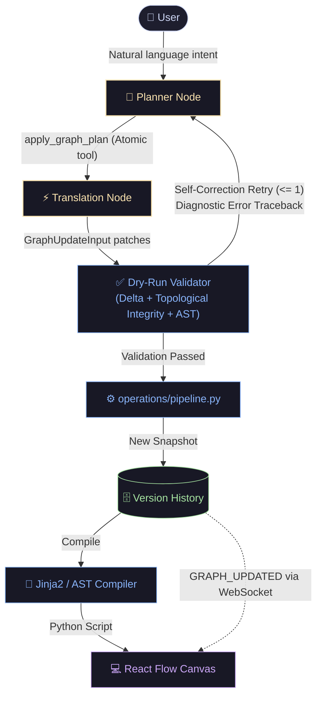

# ⚡ Graphboard
### Visual State Machine Canvas & Self-Healing LangGraph Copilot

A visual canvas and agentic development environment for designing, compiling, validating, and executing **LangGraph** state machines in Python.

---


---

## 🎯 The Core Problem & Solution

* **The Challenge with LLM Code Generation:** Asking LLMs to generate raw LangGraph Python scripts leads to high error rates — hallucinated imports, desynchronized state keys, dangling conditional branches, and unparseable ASTs that cannot reliably sync back to a visual canvas.
* **Graphboard's Solution:** A **declarative visual schema** paired with an **agentic single-call Copilot**, a **deterministic AST compiler**, and an **autonomous dry-run validation loop**. Mutations are planned as structured operations, validated against topological invariants, and compiled into idiomatic LangGraph code.

---

## 🌟 Key Engineering Highlights

* **🧠 Single-Call Atomic Copilot:** The Copilot Planner is constrained to a single, forced atomic tool (`apply_graph_plan`). It generates the complete, multi-node modification batch (variables, nodes, surgical switch branches, renames, deletions) in a single turn — eliminating multi-tool selection cutoffs, sub-agent hallucinations, and conversational token waste.
* **🛡️ Dry-Run Validation & Self-Healing:** Validates delta application, topological integrity (`assert_flow_is_complete`), and Python AST compilation *before* committing. If a gate fails, diagnostic tracebacks feed into an automated reflection loop to self-heal.
* **⚡ Real-time AST Compiler:** Dynamically compiles the visual graph schema directly into native, executable Python LangGraph code (`StateGraph`, `add_conditional_edges`, `interrupt`) via declarative Jinja2 workflow templates.
* **📦 Subprocess Sandbox:** Executes compiled user workflows inside a dedicated spawned subprocess with piped I/O and strict timeouts, protecting the main API from runaway loops.
* **🔄 Unidirectional Canvas Sync:** The server acts as the single source of truth. Changes commit via a transactional Unit of Work and stream over WebSockets to update the React Flow canvas and CodeMirror viewer.

---

## 🏗️ System Architecture



---

## 💡 Key Architectural Decisions & Trade-offs

| Design Area | Standard / Naive Approach | Graphboard Architecture | Engineering Advantage |
| :--- | :--- | :--- | :--- |
| **Graph Mutation** | Multi-agent chain or Free-form code gen | **Single Atomic Tool (`apply_graph_plan`) + Deterministic Translation** | Generates all state variables, nodes, and surgical branches in a single atomic transaction; eliminates multi-tool list cutoffs and intermediate agent hallucinations. |
| **Expression Grammar** | Deeply nested JSON-AST operator schemas | **Safe AST-Whitelisted Python Strings (`SafeExpressionValidator`)** | Minimal tool schema overhead (~3,600 prompt tokens), natural syntax for LLMs, and secure execution via visitor-checked AST sandboxing. |
| **Code Generation** | Imperative string concatenation in Python code | **Declarative Jinja2 Workflow Templates (`langgraph_workflow.py.jinja`)** | Decouples code synthesis layout from compiler logic, guaranteeing clean, formatted, idiomatic LangGraph output. |
| **Branch Routing** | Full-array overwrite on switches | **Surgical Branch Patching (`upsert_switch_branch`)** | Prevents the model from accidentally dropping or renaming unmentioned branches on complex decision nodes. |
| **Validation** | Post-execution error logging | **Pre-Commit Dry-Run + Reflection Loop** | Catches topological disconnections and compiler syntax errors *before* database commit, self-healing automatically. |
| **Canvas & Code Sync** | Client-side state mirroring & dual source of truth | **Canonical Server State + Reactive Projections** | Eliminates state race conditions; canvas and CodeMirror are pure reactive views derived from verified server snapshots and laid out deterministically via ELKjs. |
| **Script Execution** | In-process `exec()` / `eval()` | **Isolated Subprocess Sandbox** | Isolates long-running or looping workflows with hard timeout enforcement and piped `stdin`/`stdout`. |

---

## 🧩 Visual Node Vocabulary (2×2 Orthogonal Matrix)

The state machine primitives form a deliberate **2×2 grid**, plus **human control** and **memory retrieval**:

| | Deterministic Logic | AI-Driven / Dynamic |
| :--- | :--- | :--- |
| **Computation** | `LOGICAL_ASSIGNER`<br/>*(Expressions, Math, Strings, Lists)* | `AGENTIC_ASSIGNER`<br/>*(Structured Gemini LLM generation)* |
| **Routing** | `LOGICAL_SWITCH`<br/>*(Deterministic AST Boolean expressions)* | `AGENTIC_SWITCH`<br/>*(LLM intent classification / branching)* |
| **Control** | `INTERRUPT`<br/>*(Human-in-the-loop pause & resume)* | — |
| **Memory** | `RAG_RETRIEVER`<br/>*(pgvector queries with Hugging Face)* | — |

* **Deterministic Assignment Algebra:** `LOGICAL_ASSIGNER` supports a safe, orthogonal expression set (arithmetic, string formatting, list sampling/slicing, and pseudo-random generation) without embedding branching logic, keeping control flow strictly inside Switch nodes.

---

## 📊 Autonomous Evaluation Benchmark

A major engineering goal of Graphboard is **token & compute efficiency** — enabling lightweight, fast, and cost-effective models (`gemini-3.5-flash-lite` with a 1024 thinking budget) to achieve production-grade reliability on complex graph mutations without needing slow, expensive frontier models.

> **💡 Token & Cost Efficiency:** By pairing an AST-whitelisted Python expression grammar with Jinja2 declarative code generation, Graphboard maintains a compact tool schema (**~3,600 prompt tokens**) and achieves a **100.0% Pass@1 score** (every scenario succeeds on the 1st try without needing self-healing retries) on lightweight models like `gemini-3.5-flash-lite` (~$0.15/M tokens).

### 🧪 10-Tier Millionaire Game Benchmark Suite

The suite evaluates progressive state machine changes on the default trivia graph — from simple variable adjustments to complex branching, single-use constraints, interactive interrupts, and full ruleset overhauls.

> **Why the Millionaire Game?** *Who Wants to Be a Millionaire* provides a universally understood, highly stateful reference domain. It naturally requires nearly every state machine primitive: sequential question loops, conditional branching on dynamic score thresholds, one-time consumed resources (single-use lifelines), human-in-the-loop pause/resume (`INTERRUPT` for "Ask the Host"), and checkpoint safety nets. This makes it an objective, representative testbed for evaluating complex multi-step graph refactoring.

| Tier | Focus / Capability Tested | Natural User Prompt | Result | Attempts (Pass@1) | Latency | Tokens (In / Out) |
| :---: | :--- | :--- | :---: | :---: | :---: | :---: |
| **1** | **Game Length** | *"Make the game longer: 15 correct answers to win instead of 5."* | ✅ **PASS** | 1st Try | ~5.2s | 3,610 / 85 |
| **2** | **Prize Tracking** | *"Add prize money tracking so each correct answer increases cash."* | ✅ **PASS** | 1st Try | ~7.2s | 3,605 / 189 |
| **3** | **Walk-Away Option** | *"Allow the player to walk away with their current money."* | ✅ **PASS** | 1st Try | ~9.2s | 3,606 / 41 |
| **4** | **50:50 Lifeline** | *"Add a fifty-fifty lifeline filtering wrong options."* | ✅ **PASS** | 1st Try | ~9.6s | 3,595 / 187 |
| **5** | **Difficulty Tiers** | *"Questions get progressively harder: Easy (Q1-4), Med (Q5-9), Hard (Q10+)."* | ✅ **PASS** | 1st Try | ~11.2s | 3,620 / 357 |
| **6** | **Single-Use Lifelines** | *"Make lifelines single-use so they cannot be reused once used."* | ✅ **PASS** | 1st Try | ~11.8s | 3,617 / 714 |
| **7** | **Switch Question** | *"Add a 'Switch Question' lifeline that discards and draws a new one."* | ✅ **PASS** | 1st Try | ~8.0s | 3,613 / 98 |
| **8** | **Safety Nets** | *"Account for guaranteed wins after questions 5 and 10."* | ✅ **PASS** | 1st Try | ~12.0s | 3,609 / 336 |
| **9** | **Interactive Host** | *"Add an 'Ask Host' lifeline pausing for host response before resuming."* | ✅ **PASS** | 1st Try | ~7.5s | 3,620 / 149 |
| **10** | **Full Engine Overhaul** | *"Full Millionaire ruleset: 15 questions, checkpoints, walk-away, 3 lifelines."* | ✅ **PASS** | 1st Try | ~19.6s | 3,642 / 1,146 |

### 🏆 Baseline Performance Highlights (`gemini-3.5-flash-lite`)

* **100.0% First-Attempt Accuracy (Pass@1):** 10 / 10 tiers solved on the very first generation turn with zero self-healing retries needed.
* **Compact Prompt Footprint:** Minimal schema overhead of ~3,600 input tokens per request across all evaluation levels.
* **ID-Agnostic Topological Grading:** Invariant-based grading verifies graph connectivity, branch count deltas, AST boolean expressions, and state schemas without brittle LLM node ID matching.
* **Fast & Cost-Efficient:** Average resolution time of **~10.1s** per mutation.
* **Safe AST Whitelist Validation:** Sandboxed AST validation forbids unauthorized attributes/dunders and ensures undeclared state variable references fail-fast with automatic self-correction.

---

## 🛠️ Tech Stack

* **Frontend:** React 19, TypeScript, React Flow (`@xyflow/react`), ELKjs Layout Engine, CodeMirror 6, TanStack Query v5, Radix UI.
* **Backend:** Python 3.11+, FastAPI, LangGraph, SQLAlchemy 2.0, Pydantic v2, Google GenAI SDK, Neon Postgres (pgvector).
* **Tooling:** `uv` package manager, Vite, Ruff, MyPy.

---

## 🔮 Opportunities for Extension

With the core architecture achieving 10/10 Pass@1 on a lightweight model, natural opportunities to extend the project include:

* **Interactive Graph Playground (Chat with your Graph):** A dedicated execution interface enabling users to converse and interact directly with their compiled LangGraph workflow in real time, inspecting live state transformations and active routing paths.
* **Expanded State Machine Primitives:**
  * **Tool & API Calling Nodes:** Direct integration with external REST services, webhooks, and Python callables.
  * **Hierarchical Subgraphs:** Encapsulating sub-agent routines (e.g. multi-step research or negotiation loops) into nested, reusable composite nodes.
* **Cross-Model Benchmark Suite:** Expanding the 10-tier Millionaire Game benchmark across additional model families (e.g. Claude 3.5 Haiku, GPT-4o-mini, and open-weight models like Qwen 2.5) to analyze the cost-versus-accuracy Pareto frontier.
* **Live Step-by-Step State Inspector:** Stepping through graph transitions node-by-node with real-time canvas edge highlighting and state time-travel.

---

## 🚀 Quickstart

### Prerequisites
* Python 3.11+ with [`uv`](https://docs.astral.sh/uv/) installed
* Node.js 18+ and `npm`
* Gemini API Key (`GEMINI_API_KEY` in environment or `.env`)

### 1. Start Python Backend
```bash
cd python-backend
uv sync
uv run uvicorn app.main:app --reload --port 8000
```

### 2. Start Frontend
```bash
cd frontend
npm install
npm run dev
```

Open [http://localhost:5173](http://localhost:5173) in your browser to start designing and running graphs.
